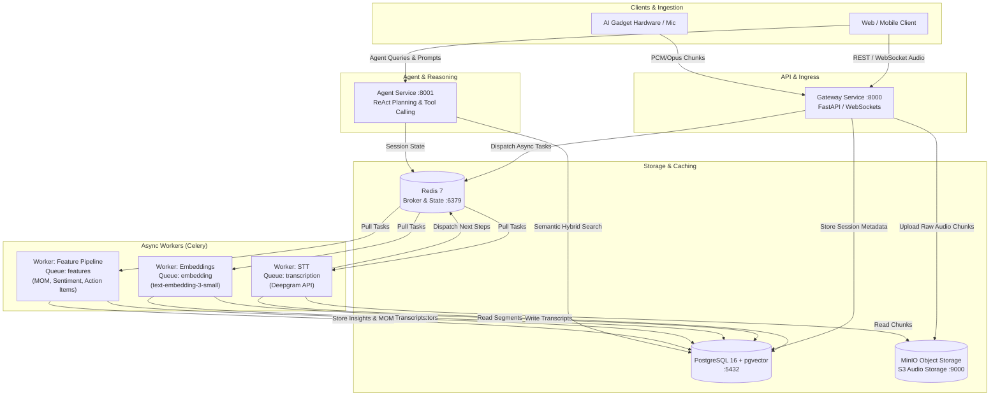

# Conversation Intelligence Platform

A high-performance, real-time audio conversation intelligence and multi-agent analytics platform built with FastAPI, Celery, PostgreSQL (pgvector), Redis, and MinIO S3.

The platform provides end-to-end processing for live and recorded conversations: real-time streaming audio ingestion, automatic speech-to-text (STT) transcription, semantic vector embeddings, LLM-powered feature extraction (Minutes of Meeting, action items, sentiment, summaries), and an autonomous agent reasoning loop.

---

## Architecture Overview



### Core Components

1. **Packages (`packages/`)**:
   - `contracts/`: Strongly-typed Pydantic v2 domain models for audio sessions, transcription chunks, feature schemas, and search requests.
   - `db/`: SQLAlchemy 2.0 async engine, declarative models (with pgvector support), repository pattern abstractions, and Alembic migrations.
2. **Gateway Service (`services/gateway/`)**:
   - High-throughput FastAPI application accepting WebSocket audio streams and REST endpoints for session management and transcript searches.
3. **Worker Service (`services/worker/`)**:
   - Celery workers divided across specialized queues:
     - `transcription`: Speech-to-text processing (Deepgram SDK).
     - `embedding`: Vector generation using OpenAI `text-embedding-3-small` and storage in pgvector.
     - `features`: Extraction of meeting summaries, action items, minutes of meeting (MOM), sentiment, and follow-ups via LiteLLM & Instructor.
4. **Agent Service (`services/agent/`)**:
   - Multi-hop reasoning engine executing plan-and-solve loops, semantic searches across transcripts, and tool integrations with OpenTelemetry tracing.

---

## Prerequisites

Before running the platform, ensure the following dependencies are installed on your host system:

- **Docker** (v24.0+) & **Docker Compose** (v2.20+)
- **Python 3.12+** (for local development and testing)
- **Task** (go-task runner) - [Installation instructions](https://taskfile.dev/installation/)
  ```bash
  # macOS (Homebrew)
  brew install go-task/tap/go-task

  # Linux
  sh -c "$(curl --location https://taskfile.dev/install.sh)" -- -d -b /usr/local/bin
  ```
- **API Keys**:
  - [Deepgram API Key](https://console.deepgram.com/) for speech-to-text.
  - [OpenAI API Key](https://platform.openai.com/api-keys) for embeddings and LLM features.

---

## Quick Start

### 1. Configure Environment

Copy the example environment template and configure your secrets:

```bash
cp .env.example .env
```

Edit `.env` to supply your `DEEPGRAM_API_KEY` and `OPENAI_API_KEY`.

### 2. Spin Up Infrastructure & Services

Start all containers in detached mode using `Task`:

```bash
task dev
```

This starts PostgreSQL with pgvector, Redis 7, MinIO S3, the Gateway service, 3 Celery worker queues, and the Agent service.

### 3. Run Database Migrations

Apply Alembic schema migrations to initialize tables and vector indices:

```bash
task migrate
```

### 4. Verify Services

Check that all containers are healthy:

```bash
docker compose -f infra/docker-compose.yml ps
```

Stream logs at any time:

```bash
task dev:logs
```

---

## Service Endpoints

| Service | Port | Endpoint / URL | Description |
| :--- | :--- | :--- | :--- |
| **Web UI Playground** | `3000` | `http://localhost:3000` | Full interactive frontend dashboard |
| **Gateway API** | `8000` | `http://localhost:8000` | REST API for audio ingest, sessions, search |
| **Gateway Swagger Docs** | `8000` | `http://localhost:8000/docs` | Interactive OpenAPI Swagger UI |
| **Gateway Health** | `8000` | `http://localhost:8000/health` | Gateway liveness and readiness probe |
| **Agent API** | `8001` | `http://localhost:8001` | Autonomous agent execution endpoint |
| **Agent Swagger Docs** | `8001` | `http://localhost:8001/docs` | Agent OpenAPI Swagger UI |
| **Agent Health** | `8001` | `http://localhost:8001/health` | Agent liveness probe |
| **MinIO S3 API** | `9000` | `http://localhost:9000` | S3-compatible audio chunk storage |
| **MinIO Web Console** | `9001` | `http://localhost:9001` | S3 bucket web UI (`minioadmin` / `minioadmin`) |
| **PostgreSQL (pgvector)** | `5432` | `localhost:5432` | Relational & vector database (`prohuman`) |
| **Redis** | `6379` | `localhost:6379` | Celery broker, cache, and state backend |

---

## Development Guide

### Available Task Commands

The project uses `Taskfile.yml` for unified development workflows:

```bash
# Infrastructure & Lifecycle
task dev              # Start all services via docker-compose
task dev:down         # Stop and remove all containers
task dev:logs         # Tail all container logs in real time
task build            # Rebuild all Docker images

# Database Migrations
task migrate          # Run all pending migrations (alembic upgrade head)
task migrate:generate -- "description"  # Generate new migration with autodetect

# Testing
task test             # Run pytest across packages and all services
task test:gateway     # Run gateway unit & integration tests
task test:worker      # Run worker unit & integration tests
task test:agent       # Run agent unit & integration tests

# Linting & Formatting
task lint             # Run Ruff linter and Mypy static type checking
task fmt              # Auto-format all Python code with Ruff
```

### Local Virtual Environment Setup

To run tests and tools locally outside Docker:

```bash
python3.12 -m venv .venv
source .venv/bin/activate

pip install --upgrade pip
pip install -e ./services/gateway
pip install -e ./services/worker
pip install -e ./services/agent
pip install ruff mypy pytest pytest-asyncio alembic
```

### Adding New Feature Extractors

1. **Define Schema**: Add your Pydantic schema in `packages/contracts/features.py`.
2. **Implement Extractor**: Create an extraction class inheriting from `BaseFeature` in `services/worker/app/features/`.
3. **Wire Task**: Register the step in `services/worker/app/tasks/feature_pipeline.py`.
4. **Persist Results**: Store results via `FeatureRepository` into the `feature_results` table.

---

## Environment Variables Reference

| Variable | Default | Description |
| :--- | :--- | :--- |
| `POSTGRES_USER` | `postgres` | PostgreSQL username |
| `POSTGRES_PASSWORD` | `postgres` | PostgreSQL password |
| `POSTGRES_DB` | `prohuman` | Database name |
| `DATABASE_URL` | `postgresql+asyncpg://...` | SQLAlchemy async connection string |
| `REDIS_URL` | `redis://localhost:6379/0` | Redis connection URL |
| `S3_ENDPOINT_URL` | `http://localhost:9000` | S3 / MinIO endpoint URL |
| `S3_ACCESS_KEY` | `minioadmin` | S3 access key |
| `S3_SECRET_KEY` | `minioadmin` | S3 secret key |
| `S3_BUCKET_NAME` | `audio-recordings` | S3 bucket for audio storage |
| `DEEPGRAM_API_KEY` | *None* | Deepgram STT API key |
| `OPENAI_API_KEY` | *None* | OpenAI API key for LLM and embeddings |
| `GATEWAY_DATABASE_URL` | *None* | Gateway DB connection override |
| `GATEWAY_REDIS_URL` | *None* | Gateway Redis connection override |
| `GATEWAY_MAX_WS_CONNECTIONS` | `100` | Gateway max concurrent WebSocket connections |
| `GATEWAY_RATE_LIMIT_REQUESTS_PER_MINUTE` | `100` | Gateway rate limit threshold |
| `WORKER_DEFAULT_LLM_MODEL` | `gpt-4o` | Default model for feature extraction |
| `WORKER_EMBEDDING_MODEL` | `text-embedding-3-small` | OpenAI vector embedding model |
| `WORKER_EMBEDDING_DIMENSIONS` | `1536` | Vector embedding dimension size |
| `AGENT_DATABASE_URL` | *None* | Agent DB connection override |
| `AGENT_DEFAULT_LLM_MODEL` | `gpt-4o` | Primary LLM for agent reasoning |
| `AGENT_MAX_TOTAL_HOPS` | `15` | Maximum planning iterations for agent |

See [.env.example](file:///.env.example) for the full list of configuration options.

---

## API Documentation Links

When running locally with `task dev`:
- **Gateway Interactive Docs (Swagger)**: [http://localhost:8000/docs](http://localhost:8000/docs)
- **Gateway Alternative Docs (ReDoc)**: [http://localhost:8000/redoc](http://localhost:8000/redoc)
- **Agent Service Docs (Swagger)**: [http://localhost:8001/docs](http://localhost:8001/docs)
- **MinIO Object Storage Console**: [http://localhost:9001](http://localhost:9001)

---

## Continuous Integration

The repository includes a complete GitHub Actions pipeline (`.github/workflows/ci.yml`) that runs on every push and pull request to `main`:
1. **Lint & Type Check**: Validates PEP 8 styling with `ruff` and type soundness with `mypy`.
2. **Database & Service Tests**: Spins up real PostgreSQL with `pgvector` and Redis service containers to test `packages/`, `services/gateway/`, `services/worker/`, and `services/agent/`.
3. **Container Builds**: Validates Docker image builds for the Gateway, Worker, and Agent services.
